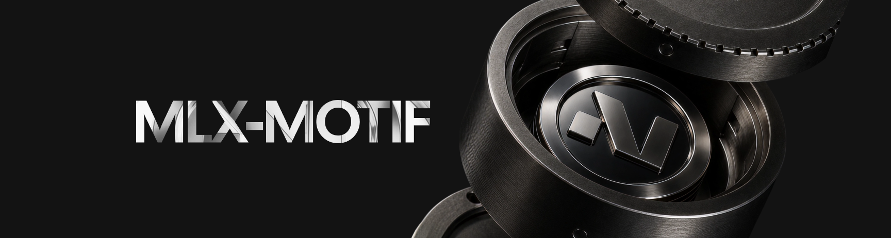

# mlx-motif



The canonical [MLX](https://github.com/ml-explore/mlx) port of [Motif Technologies'](https://huggingface.co/Motif-Technologies) language models on Apple Silicon.

Motif's flagship LLMs combine **Grouped Differential Attention** ([2510.06949](https://arxiv.org/abs/2510.06949) / [2410.05258](https://arxiv.org/abs/2410.05258)) with the **PolyNorm** activation ([2411.03884](https://arxiv.org/abs/2411.03884)). Neither primitive ships in mlx-lm. This repo implements both natively in MLX, with a stack of custom Metal kernels that beats `mx.fast.scaled_dot_product_attention` on the differential-attention path.

## Headline numbers

Motif-2-12.7B-Reasoning at 4-bit, M1 Max (32-core GPU, 64 GB), 5-run mean ± stdev:

| Prompt length | mlx-lm-only baseline¹ | with custom kernels | speedup |
|---|---|---|---|
| 5 tokens (short)   | 34.70 ± 0.06 tok/s | **40.64 ± 0.15 tok/s** | **+17%** |
| 800 tokens (long)  | 21.56 ± 0.05 tok/s | **34.71 ± 0.08 tok/s** | **+61%** |
| 3.2k tokens (xlong)| ~14 tok/s²         | **24.02 ± 0.17 tok/s** | **+71%** |

¹ With `MLX_MOTIF_DUAL_V=0` (V-stacked SDPA + scalar gda_post fallback).
² Estimated; full A/B at 3.2k took prohibitively long with the slow path.

Output is **byte-identical** between the in-tree kernel and reference paths (`MLX_MOTIF_DISABLE_KERNELS=1`) — verified end-to-end on real Motif weights. Numerical parity against the HuggingFace PyTorch reference is **not** independently verified; the 12.7B-q4 quality is checked via perplexity (`scripts/perplexity.py`) instead.

## Status

**Shipped:** package + HF→MLX converter, mixed-precision quantization (`--quant-preset uniform|mixed|mlp_lowbit`), fused PolyNorm + GDA-post Metal kernels, shared-QK dual-V SDPA, 4-slot KV cache (fp16 / q4 / q8) with in-kernel quant-input SDPA (`sdpa_dual_v_q4`), OpenAI-compatible server with `<think>` streaming toggle and prompt-based tool calling, speculative-decoding wiring, and a native Swift/macOS stack (SwiftUI chat app + MLX-Swift runtime — see [`swift/`](swift/README.md)).

**Open:** HF Hub release of converted checkpoints, multi-chip validation (M2/M3/M4), long-context end-to-end bench (16k+), prefill-path kernels.

## Install

```bash
git clone …/mlx-motif && cd mlx-motif
uv pip install -e ".[dev]"   # or: uv sync --extra dev  (uses the committed uv.lock)
```

Requires Python ≥ 3.11, MLX ≥ 0.21, Apple Silicon (only M1 Max validated end-to-end so far).

## Quickstart

```bash
# 1. Convert an HF checkpoint (defaults to bf16; add --quantize for q4)
mlx-motif convert \
  --hf-path Motif-Technologies/Motif-2-12.7B-Reasoning \
  --out ./out/motif-12.7b-q4 \
  --quantize --bits 4

# 2. Generate
mlx-motif generate --model ./out/motif-12.7b-q4 --prompt "Hello, world."

# 3. Serve (OpenAI-compatible HTTP)
mlx-motif serve --model ./out/motif-12.7b-q4 --port 8080
```

Programmatically:

```python
from mlx_lm import generate
from mlx_motif import load

model, tokenizer = load("./out/motif-12.7b-q4")
print(generate(model, tokenizer, prompt="…", max_tokens=128))
```

`mlx_motif.load` wires our `Model` into mlx-lm's loader (default: with QKV projection fusion). Everything downstream — `mlx_lm.generate`, `mlx_lm.server`, speculative decoding — works the same as for stock mlx-lm models. Runnable end-to-end scripts live in [`examples/`](examples/) (`examples/convert.py`, `examples/generate.py`).

### Conversion presets

`mlx-motif convert` defaults to bf16; `--quantize` enables quantization. The `--quant-preset` flag selects the precision policy (see [`quant.py`](src/mlx_motif/quant.py)):

```bash
# Uniform q4 (default preset when --quantize is set)
mlx-motif convert --hf-path … --out ./out/u-q4 --quantize --bits 4 --group-size 64

# Mixed: keep q_proj higher-precision (--q-proj-bits), everything else at --bits
mlx-motif convert --hf-path … --out ./out/mixed --quantize --quant-preset mixed --q-proj-bits 6 --bits 4

# mlp_lowbit: push MLP projections to --mlp-bits/--mlp-group-size, rest at --bits/--group-size
#   (memory ↓25%, speed −31%, PPL +10% — see docs/experiments/experiment-mlp-lowbit.md)
mlx-motif convert --hf-path … --out ./out/lowbit --quantize --quant-preset mlp_lowbit --mlp-bits 3 --mlp-group-size 32
```

## OpenAI-compatible server

`mlx-motif serve` exposes `POST /v1/chat/completions` (SSE streaming when `stream: true`) and `GET /v1/models`, wrapping `mlx_lm.generate.stream_generate`:

```bash
mlx-motif serve \
  --model ./out/motif-12.7b-q4 \
  --host 127.0.0.1 --port 8080 \
  --model-id motif \
  --think-mode visible   # visible | hidden | captured
```

**`--think-mode`** controls Motif's `<think>…</think>` reasoning trace (overridable per-request via an `extra_body={"think_mode": …}` field):

| Mode | Behavior |
|---|---|
| `visible` (default) | reasoning trace streams as-is |
| `hidden` | tokens between `<think>` and `</think>` are dropped from the output |
| `captured` | trace dropped from the visible stream but returned separately (e.g. a `reasoning` field) |

Motif's reasoning chat template pre-opens the think block (`<|assistant|><think>`), so the filter is primed to start *inside* a think block when the prompt ends that way — there's no opening tag in the stream, only the closing `</think>`.

### Tool calling (prompt-based)

The server accepts the OpenAI `tools` / `tool_choice` fields, implemented as **prompt-injected** tool calling — Motif's chat template has no native tool tokens (see [`tool_calls.py`](src/mlx_motif/tool_calls.py)). When `tools` are present:

1. A deterministic system preamble is prepended describing each tool and instructing the model to emit a single `{"tool_call": {"name", "arguments"}}` JSON object.
2. The output is buffered (not streamed delta-by-delta, since the small model tends to loop the object), and the **first** valid balanced-JSON tool call is extracted and returned as an OpenAI `tool_calls` chunk. If no tool call is emitted, the buffered text is flushed as normal content.

`tool_choice: "none"` suppresses tools; `auto`/`required` behave like the default prompt. This is a pragmatic compatibility shim, not model-native function calling — treat it accordingly.

## Swift / native macOS app

A native macOS stack lives under [`swift/`](swift/README.md): a SwiftUI **chat app** (`MotifChatApp`), a `MotifKit` runtime layer with an OpenAI-compatible bridge and `<think>` filtering that mirrors the Python server, and an optional `MotifKitMLX` overlay (gated by `MOTIFKIT_ENABLE_MLX=1`) that ports the Motif decoder and the custom Metal kernels to MLX-Swift. It also ships native CLIs (`MotifNativeGenerate`, `MotifNativeEvaluate`, `MotifNativeServe`, `MotifDecodeBench`).

```bash
# Default lightweight build (talks to `mlx-motif serve` over /v1)
swift test --package-path swift
swift build --package-path swift --target MotifChatApp

# Native MLX overlay (Swift 6.1+ recommended; see swift/README.md for toolchain pins)
MOTIFKIT_ENABLE_MLX=1 swift run --package-path swift MotifChatApp
```

The Swift MLX path reads the same `MLX_MOTIF_*` feature flags as the Python path. See [`swift/README.md`](swift/README.md) for the full workflow and [`docs/server-parity.md`](docs/server-parity.md) for how the two servers line up.

## Architecture

Motif-2-12.7B uses **Grouped Differential Attention** — each token's attention is the difference between two softmax distributions weighted by a learnable `λ`, with origin/noise heads grouped (`gr=4` origin heads share one noise head per group). The 2.6B variant uses the simpler ungrouped form. Both share the **PolyNorm** MLP activation (a 3-term polynomial RMS-norm).

The MLX forward path of one decoder layer at decode (S=1):

```
x  ─→  RMSNorm  ─→  qkv_proj  ─→  split (q | k | v)
                       │
                       ├─→  q (origin-first layout) ─→  rope
                       │                              │
                       │                              └─→  q1 (32h, slice)
                       │                                   q2 (8h,  slice)
                       │
                       ├─→  k ─→  rope ─→  cache.update_and_fetch_4
                       │                              │
                       │                              └─→  k1, k2
                       │
                       └─→  v ─→  cache.update_and_fetch_4
                                                      │
                                                      └─→  v1, v2

   ┌─→  sdpa_dual_v(q1, k1, v1, v2, scale)  ─→  attn_origin (32h × 2D)  ┐
   │       (custom Metal kernel, native GQA broadcast)                  │
   │                                                                    │
   └─→  sdpa_dual_v(q2, k2, v1, v2, scale)  ─→  attn_noise  (8h  × 2D)  ┘
                                                                        │
   ┌────────────────────────────────────────────────────────────────────┘
   │
   └─→  gda_post_split(attn_origin, attn_noise, λ, λ_init, subln_w)  ─→  out
            (custom Metal kernel: differential subtract + SubLN + scale, no concat)
                       │
                       └─→  o_proj  ─→  + residual  ─→  RMSNorm  ─→  MLP  ─→  + residual
```

## The custom Metal kernels

All production kernels live in the [`src/mlx_motif/kernels/`](src/mlx_motif/kernels/) package, split by domain (`attention.py`, `gda.py`, `mlp.py`, with shared helpers in `_common.py`). Each production kernel ships with a pure-MLX reference (`*_reference`) and a parametric correctness test under [`tests/`](tests/).

### `sdpa_dual_v` — the headline kernel

Shared-QK, dual-V SDPA decode. Computes `cat([SDPA(q,k,v1), SDPA(q,k,v2)], axis=-1)` in **one** Metal pass — one softmax computation, two V slabs accumulated in the same KV loop, native GQA broadcast.

**Why it exists.** MLX's `mx.fast.scaled_dot_product_attention` requires `query_head_dim == value_head_dim` and only ships templates for `D=V ∈ {64, 96, 128, 256}` ([`mlx/backend/metal/scaled_dot_product_attention.cpp:618-621`](https://github.com/ml-explore/mlx/blob/main/mlx/backend/metal/scaled_dot_product_attention.cpp)). For grouped DiffAttn we need V of width `2·D=256` paired with `D=128` K. The combination falls back to a generic path. Splitting into two `V=128` calls works but recomputes Q·Kᵀ each time. This kernel does QK-and-softmax once and accumulates into both V slabs.

**Threadgroup geometry** (matches MLX `sdpa_vector.h` exactly):
- `BN=32` simdgroups × `BD=32` lanes = 1024 threads
- `simd_gid` strides KV positions, `simd_lid` strides head_dim
- Per-thread persistent state: `q[4] + o1[4] + o2[4]` = 12 fp32 (vs MLX's 8) — fits comfortably under M1 Max's register-pressure-induced 896-thread cap

**Numerical lessons** (the hard way — see commits `6922acb`, `acc2de7`):
- Use `-1e30f` as the initial-max sentinel, NOT `-INFINITY`. `metal::fast::exp(-INF − finite)` returns NaN on Apple GPUs.
- Channel coverage is `BN × v_per_thread × num_slabs = output_channels`. For our 2D=256 output: 32 × 4 × 2 = 256 ✓. Halving BN breaks coverage.

### `sdpa_dual_v_q4` — quantized-input variant

Same algorithm and threadgroup layout as `sdpa_dual_v`, but `K`, `V1`, `V2` are read straight out of HBM as MLX quantized triples `(data: uint32, scales: T, biases: T)` and dequantized in registers. Auto-selected at decode time when the cache is `MotifGroupedQuantizedKVCache` (gate via `MLX_MOTIF_QUANT_SDPA`).

**Why it exists.** The naive path is `mx.dequantize(K)` + `mx.dequantize(V1)` + `mx.dequantize(V2)` + `sdpa_dual_v`. The dequants run every decode step, materialize three full-cache-size fp16 tensors, and never get cached. By inlining the dequant into the attention kernel we skip 3 ops per layer per token AND keep the K/V reads in their packed 4-bit/8-bit form (≈3.6× lower HBM traffic).

**Bench (M1 Max, 12.7B decode shape, B=1, H_q=40, H_kv=8, D=128, group_size=64; min of 10 trials × 64 batched calls):**

| KV    | dequant→sdpa_dual_v | `sdpa_dual_v_q4` (4b) | (8b)   | q4 vs deq | q8 vs deq |
|-------|---------------------|------------------------|--------|-----------|-----------|
| 1024  | 0.118 ms            | 0.086 ms               | 0.080 ms | **0.73×** | **0.68×** |
| 4096  | 0.320 ms            | 0.227 ms               | 0.220 ms | **0.71×** | **0.62×** |
| 8192  | 0.637 ms            | 0.415 ms               | 0.413 ms | **0.65×** | **0.58×** |
| 16384 | 1.223 ms            | 0.794 ms               | 0.769 ms | **0.65×** | **0.57×** |

(At KV ≤ 800 the dispatch overhead from 9 input buffers makes it borderline-or-slower than the dequant path; only the long-context regime wins.)

**Key implementation tricks** (see `docs/sdpa_dual_v_q4_design.md` and the `_SDPA_DUAL_V_Q4_SRC` source):
- **MLX qdot trick** for the QK side: precompute `q_pre[j] = scale * q[j] / 2^(shift_base + j*BITS)` once per lane, then in the kv loop the K nibble at position `j` — appearing in the packed word as `nibble * 2^(shift_base + j*BITS)` after a mask-without-shift — multiplied by `q_pre[j]` gives the correctly-weighted partial dot. Saves one shift per channel per kv step (the K side is shift-free in the inner loop). Borrowed from MLX's `qdot` helper in `mlx/backend/metal/kernels/quantized.h`.
- **Per-lane K mask LUT** computed once outside the loop: 4 `uint32` masks → in-place mask + cast-to-float + multiply-and-add, no shifts.
- **Per-lane group_idx is correct only if** `qk_per_thread ≤ group_size` and `qk_per_thread ≤ EL_PER_INT`. For `D=128, group_size ∈ {32, 64, 128}, bits ∈ {4, 8}` both hold, so a single scale/bias load per lane per kv step covers all 4 channels.
- **Same -1e30f sentinel** as `sdpa_dual_v` — `metal::fast::exp(-INF − finite) = NaN` on Apple GPUs.
- **Bit-extract probe** (`tests/test_dequant_probe.py`) locks down the 4/8-bit unpack against `mx.dequantize` standalone, so a future correctness regression in the full kernel can be triaged in isolation.

### `gda_post_split` — fused post-attention reduction

Reads `attn_origin` and `attn_noise` as **separate** buffers, broadcasts noise via index inside the threadgroup (`h_n = h_o / gr`), computes `(attn_o − λ·attn_n)`, applies SubLN, scales by `(1 − λ_init)`. Replaces the previous chain that required `mx.concatenate([attn_o, attn_n], axis=1)` (~316 µs/layer on its own) followed by 5+ separate ops.

### `polynorm` — fused MLP activation

Single-pass `polynorm(x) = w0·norm(x³) + w1·norm(x²) + w2·norm(x) + b`. Each threadgroup processes one row, computes the three power-means via simdgroup reductions, then writes the linear combination.

### Variants we tried and removed

Several kernels and design alternatives were built, measured, and ultimately did not ship — single-pass dual-V beat 2-pass at every tested KV, `polynorm_mul` lost to the lazy-graph chain fusion, `qmv_dual_q4` lost because `x` was already in L1, and `gda_decode` flash hit the M1 Max register-pressure cap. They're all written up with snippets + benches + "when this might win" notes in [`docs/experiments/`](docs/experiments/) — useful priors before re-trying any of them on different hardware.

The one variant that's still wired up (with a documented trade-off) is the 4-bit quantized KV cache: `MotifGroupedQuantizedKVCache` saves ~15% peak memory at 3.2k context, originally cost 12% decode speed via dequant-bridge fetch, and is now net-positive on both axes thanks to the **`sdpa_dual_v_q4` kernel reading it directly** — beats the dequant→fp16 path by 27-43% per-call at KV ∈ [1024, 16384] (e2e on real Motif: +18% at 3k prompt vs the same cache's dequant path).

## Model surgeries

Two transforms applied at load time (in `Model.fuse_qkv()`, called by `mlx_motif.load(..., fuse_qkv=True)`):

### QKV projection fusion (+10% on the matmul)

Concatenates `q_proj`, `k_proj`, `v_proj` weights along the output axis into one `qkv_proj` of shape `(in=4096, out=q+k+v=9216)`. Hits MLX's quantized matmul sweet spot — single fused matmul is faster than three smaller ones.

| Path | Per-layer matmul cost (M1 Max, q4) |
|---|---|
| 3 separate q4 linears (q + k + v) | 320 µs |
| 1 fused q4 linear + 3-way `mx.split` | **287 µs** (-10%) |

### Origin-first Q row permutation

The HF stripe layout `[g0_o1, g0_o2, ..., g0_o4, g0_n, g1_o1, ...]` forces the per-step `q1`/`q2` split into a stride-pattern reshape that materializes a copy. `fuse_qkv()` permutes Q rows to `[origin..origin | noise..noise]` so the split becomes a contiguous-axis slice (zero-copy view). Architecturally cleaner; no measurable end-to-end delta because MLX's lazy graph absorbs the strided-reshape copy in the chain.

## Benchmarks

All numbers from M1 Max, 64 GB, 12.7B-Reasoning q4, 5 measurement runs after 3 warmup runs, same Python session for A/B fairness:

```
                      MLX-only baseline        with custom kernels       speedup
short prompt (5 tok)   34.70 ± 0.06 tok/s     40.64 ± 0.15 tok/s         +17%
med   prompt (164)     ~30 tok/s              ~37 tok/s                  ~+23%
long  prompt (800)     21.56 ± 0.05 tok/s     34.71 ± 0.08 tok/s         +61%
xlong prompt (3204)    14 tok/s (estimate)    24.02 ± 0.17 tok/s         +71%
```

**The win compounds with context length.** Attention is ~10% of decode time at 64 KV tokens but grows linearly while MLP stays fixed. Our custom path saves attention time specifically.

### Per-op profile after all optimizations (M1 Max, isolated microbench)

| Op | Cost | Share |
|---|---|---|
| qkv_proj 4096→9216 (q4, fused) | 287 µs | 9% |
| sdpa_dual_v (KV=256, 32+8 split) | ~282 µs | 9% |
| o_proj 8192→4096 (q4) | 437 µs | 14% |
| mlp gate 4096→16384 (q4) | 522 µs | 17% |
| mlp up   4096→16384 (q4) | 522 µs | 17% |
| mlp down 16384→4096 (q4) | 584 µs | 18% |
| RMSNorm × 2, polynorm, gda_post_split, residuals | rest | ~16% |

Note: isolated microbench ≠ in-chain time. MLX's lazy graph fuses many of these; chained per-layer time is roughly half the sum.

## Development & tests

```bash
uv pip install -e ".[dev]"   # pytest, pytest-cov, ruff, torch
pytest                       # kernel correctness, cache, tool-calls, think-filter
ruff check .                 # lint
```

Most tests run anywhere (the kernel tests compare against pure-MLX references). The numerical **parity** test against the HF PyTorch reference is opt-in: set `MLX_MOTIF_PARITY=<hf-checkpoint>` and `MLX_MOTIF_PARITY_MLX=<converted-mlx-checkpoint>` before running `pytest`. Swift tests run via `swift test --package-path swift` (add `MOTIFKIT_ENABLE_MLX=1 --filter MotifKitMLXTests` for the MLX overlay). CI layout is documented in [`docs/ci.md`](docs/ci.md).

## Codebase layout

For where each module/test/script lives and what it does, see [`docs/codebase-tour.md`](docs/codebase-tour.md).

**More docs:**

- [`docs/blog-quantized-attention-on-m1-max.md`](docs/blog-quantized-attention-on-m1-max.md) — design narrative for the q4 attention path
- [`docs/sdpa_dual_v_q4_design.md`](docs/sdpa_dual_v_q4_design.md) — kernel-level design notes for `sdpa_dual_v_q4`
- [`docs/server-parity.md`](docs/server-parity.md) — Python vs Swift OpenAI-compatible server parity
- [`docs/experiments/`](docs/experiments/README.md) — negative-result kernels (writeups + benches)
- [`docs/benchmarks/`](docs/benchmarks/README.md) — certified benchmark sweeps and raw captures
- [`docs/ci.md`](docs/ci.md) — CI lanes
- Swift: [`swift/README.md`](swift/README.md), [`docs/swift-motif-roadmap.md`](docs/swift-motif-roadmap.md), [`docs/swift-app-smoke.md`](docs/swift-app-smoke.md), [`docs/swift-full-parity-followup.md`](docs/swift-full-parity-followup.md)

## Environment variables

| Variable | Default | Effect |
|---|---|---|
| `MLX_MOTIF_DUAL_V` | `1` | `0` disables `sdpa_dual_v` and uses the V-stacked SDPA + `gda_post` fallback (the kernel A/B baseline) |
| `MLX_MOTIF_4SLOT_CACHE` | `0` | `1` = unquantized 4-slot cache; `q4` / `q8` = quantized 4-slot cache. Combined with `MLX_MOTIF_QUANT_SDPA=1` (default) the q4/q8 path delivers per-call attention 27-43% faster than dequant→fp16 at KV ∈ [1024, 16384] (e2e on Motif 12.7B: +18% at 3k prompt vs same cache's dequant path). |
| `MLX_MOTIF_QUANT_SDPA` | `1` | `0` disables `sdpa_dual_v_q4` and falls back to dequant-bridge fetch + `sdpa_dual_v` even when the cache is quantized |
| `MLX_MOTIF_DISABLE_KERNELS` | `0` | `1` falls back to pure-MLX references for all kernels (correctness-only mode) |
| `MLX_MOTIF_FUSE_QKV` (Swift) | `1` | QKV-projection fusion for the grouped q4 decode path. Defaults ON; `0`/`off` opts out. Numerical equivalence (fused == unfused logits, incl. the q4 path) is gated by `MotifQKVFusionParityTests` under `MOTIFKIT_RUN_MLX_RUNTIME_TESTS=1`. Speed: the synthetic decode micro-benchmark (`MotifDecodeBench`, q4 gs=64, B=1, S=1) shows ~12-20% lower median ms/step at the 12.7B per-layer shape with fusion ON — a synthetic-weights per-decode-step measurement on one machine, **not** an end-to-end tok/s number. This is corroborated by the earlier real-checkpoint sweep `docs/benchmarks/benchmark-sweep-qkv-fusion-20260527T112300Z.json` (1.05x@p500 / 1.20x@p3000 on a converted 12.7B q4); end-to-end re-validation on the target checkpoint is still recommended before release. |
| `MLX_MOTIF_PARITY` | unset | path to HF checkpoint to enable the parity test |
| `MLX_MOTIF_PARITY_MLX` | unset | path to converted MLX checkpoint for the parity test |

## What we tried that didn't work (negative results)

Every experiment — code snippet, bench numbers, root cause, and "when this might win on different hardware" — lives in [`docs/experiments/`](docs/experiments/). The short list:

| Idea | Status |
|---|---|
| `polynorm_mul` fused kernel | -7% e2e — [doc](docs/experiments/experiment-polynorm-mul.md) |
| 2-pass dual-V SDPA | slower at every KV — [doc](docs/experiments/experiment-sdpa-dual-v-2pass.md) |
| `qmv_dual_q4` fused gate+up GEMV | -9% to -77% — [doc](docs/experiments/experiment-qmv-dual-q4.md) |
| `gda_decode` single-pass flash | ~2.7× slower (M1 Max register cap) — [doc](docs/experiments/experiment-gda-decode-flash.md) |
| `mlp_lowbit` q3/gs=32 MLP preset | **kept** — memory ↓25%, speed -31%, PPL +10% — [doc](docs/experiments/experiment-mlp-lowbit.md) |
| 4-slot quantized cache via dequant bridge | **superseded** by `sdpa_dual_v_q4` — [doc](docs/experiments/experiment-quant-kv-dequant-bridge.md) |
| `mx.compile` MLP, fuse gate+up matmuls, concat q+k RoPE, single-call 40-head dual_v, composable q4 chain | [combined writeup](docs/experiments/experiment-not-landed.md) |

Negative-result code itself is **not in the codebase** — only the writeups, exact deleted-symbol provenance, and commit pointers. The docs keep the load-bearing snippets inline; full removed implementations are recoverable from git history with the file/symbol references in each experiment page.

## Limitations / known issues

- **Tested on M1 Max only.** The kernel constants (BN, BD, register footprint) are tuned for Apple7 / M1 Max. M2/M3/M4 may need re-tuning; haven't validated.
- **Decode-only kernels (S=1).** Prefill goes through the unchanged V-stacked SDPA path. The attention kernels assert S=1.
- **One model class verified end-to-end at q4.** bf16 unquantized path passes structural tests but no end-to-end generation bench.
- **Parity verified at bf16, not q4.** Quantization adds noise that hasn't been numerically diffed against HF.
- **Speculative decoding wires up but doesn't beat baseline.** The 2.6B → 12.7B draft/target ratio isn't aggressive enough on M1 Max — accept rate ~70% but draft cost wipes the gain. Needs a sub-1B Motif draft model to actually win.

## What's next

In order of expected payoff — contributions welcome:

1. **HF Hub upload** of the converted MLX checkpoints (`mlx-community/Motif-2-12.7B-Reasoning-MLX-q4` etc).
2. **Multi-chip validation** — re-tune and re-bench the Metal kernels on M2/M3/M4.
3. **Long-context bench** at 16k+ to characterize the 4-slot quantized cache's memory savings (q4 kernel landed; need an end-to-end measurement).
4. **Prefill-optimized kernels** — currently prefill uses MLX's stock path. A 2-pass design may fit prefill, even though the decode-time `sdpa_dual_v_2pass` lost at Motif's tested shapes (see [docs/experiments/](docs/experiments/)).

## Reference architecture

For ground truth on the math, see:

- `/tmp/refs/sdpa_vector.h` (run `curl -sL https://raw.githubusercontent.com/ml-explore/mlx/main/mlx/backend/metal/kernels/sdpa_vector.h -o sdpa_vector.h`) — MLX's vectorized SDPA decode, the template our kernels follow.
- HF `Motif-Technologies/Motif-2-12.7B-Reasoning/modeling_motif.py` — the PyTorch reference for Grouped Differential Attention; our kernels are validated against this layer-by-layer.
- arXiv [2510.06949](https://arxiv.org/abs/2510.06949) (GDA), [2410.05258](https://arxiv.org/abs/2410.05258) (DiffTransformer), [2411.03884](https://arxiv.org/abs/2411.03884) (PolyNorm).

## License

MIT — see `LICENSE`. Motif checkpoints retain their original Motif Technologies license; this port does not redistribute weights.
